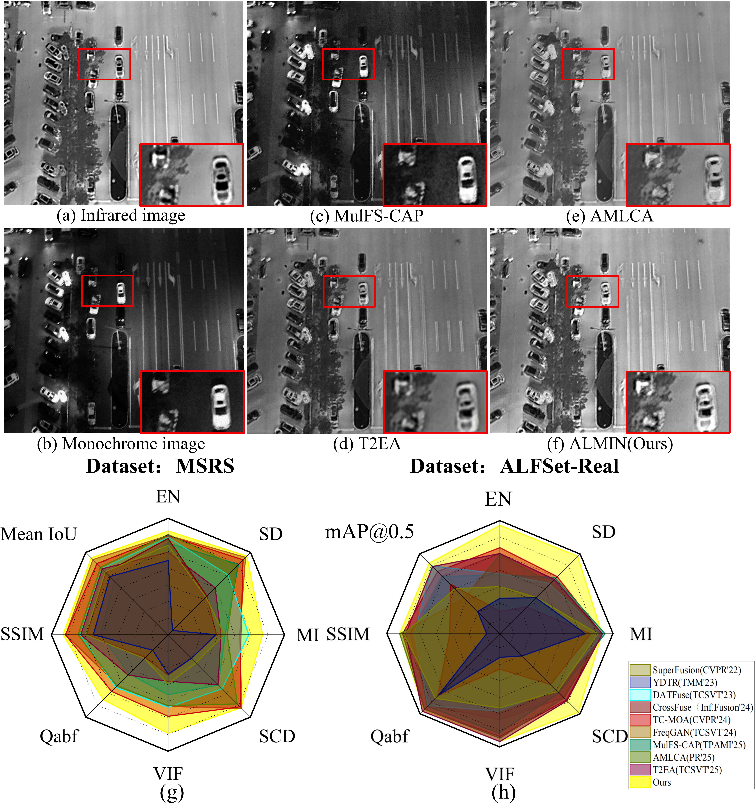
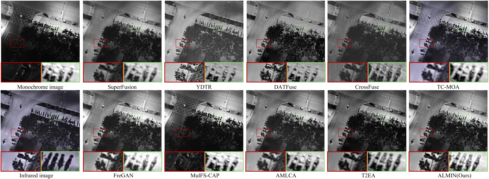

# Illumination-Prior-Guided-Monochrome-Infrared-Fusion-for-Low-Light-Aerial-Imaging [TGRS 2026]

This repository is the official implementation of the TGRS 2026 paper "[Illumination-Prior-Guided Monochrome–Infrared Fusion for Low-Light Aerial Imaging](https://ieeexplore.ieee.org/document/11433819)".

## Abstract

**The superior performance of visible–infrared image fusion in ground-level low-light imaging has driven significant advances in this field. However, aerial low-light scenes are characterized by wide illumination variations, complex textures, and motion blur, making it difficult for existing methods to simultaneously restore details, correct illumination, and integrate complementary information. To overcome these challenges, we propose an aerial low-light monochrome–infrared fusion network (ALMIN), which pioneers the use of monochrome–infrared imaging for aerial low-light enhancement. First, we propose an illumination prior extractor that leverages local illumination priors to enhance the texture details of aerial monochrome images, effectively preventing detail loss during subsequent fusion and generating dynamic weights that capture regional illumination variations in aerial scenes. Second, we introduce prior illumination dynamic weights to guide a dual-modality fusion restorer, effectively integrating monochrome and infrared information for the reconstruction of illumination and reflectance components. Within this framework, we design a frequency-refined denoising block (FRDB), a global illumination perception block (GIPB), a fine-grained reflectance perception block (FRPB), and a light-guided fusion block (LGFB) to achieve the effective brightness correction and detail restoration. Third, we construct aerial low-light fusion set (ALFSet), the first multimodal low-light aerial image dataset captured with a monocular and an infrared stereo camera, to evaluate the proposed ALMIN. Extensive quantitative and qualitative experiments demonstrate the superiority and effectiveness of our ALMIN.**

## ALMIN

### Monochrome Advantage:
<p align="center">
  
</p>

### ALMIN Model Architecture:
<p align="center">
  
</p>

### Quantitative Experiment:
<p align="center">
  
</p>

### Qualitative Experiment:
<p align="center">
  
</p>

## Citation

If you found this code useful, please cite the paper. Welcome 👍 Fork and Star 👍, then I will let you know when we update.

```latex
@ARTICLE{11433819,
  author={Lin, Peiyang and Wang, Junbo and Lin, Liqun and Zheng, Xiangtao and Zhao, Tiesong and Kwong, Sam},
  journal={IEEE Transactions on Geoscience and Remote Sensing}, 
  title={Illumination-Prior-Guided Monochrome–Infrared Fusion for Low-Light Aerial Imaging}, 
  year={2026},
  volume={64},
  number={},
  pages={1-13},
  keywords={Lighting;Imaging;Image restoration;Image fusion;Cameras;Feature extraction;Noise;Image color analysis;Reflectivity;Image enhancement;Low-light aerial imaging;monochrome–infrared image fusion;Retinex theory},
  doi={10.1109/TGRS.2026.3673662}
}
